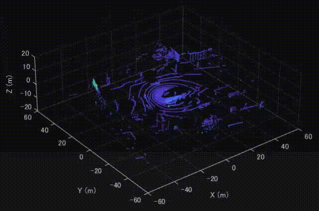
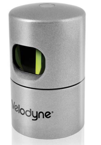
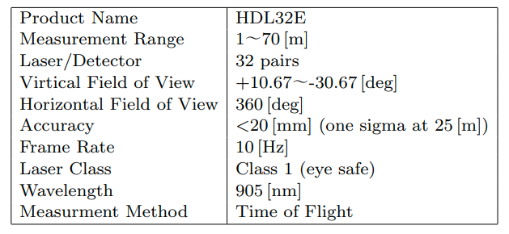
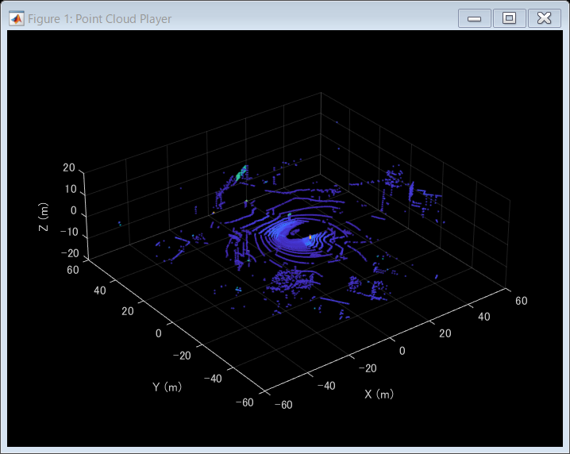

# <span style="color:rgb(213,80,0)">MATLABでVelodyne LiDARのデータを可視化してみよう</span>

この記事はMATLAB/Simulink Advent Calendar 2023の15日目の記事として書かれています。


https://qiita.com/advent-calendar/2023/matlab

# はじめに

LiDAR（Light Detection and Ranging）は、主にレーザー光線を物体に照射することで対象までの距離を測定します。それにより、周辺の障害物を検知したり、その環境の3次元的な地図を作成したりすることができます。


LiDARは多くの種類がありますが、その中でもVelodyne LiDARが有名です。本記事では、Velodyne LiDARのパケットキャプチャ(pcap)ファイルを再生し、3次元点群データを可視化する方法について紹介します。


MATLABにてVelodyne LiDARのデータを可視化した時の様子を示します。MATLABを利用すれば、特別なセットアップも必要なく、簡単に可視化することができます。

<p style="text-align:left"></p>

# Velodyne HDL32Eについて

以下にVelodyne HDL32Eの画像を掲載します。

<p style="text-align:left"></p>


https://velodynelidar.com/wp-content/uploads/2019/12/97-0038-Rev-N-97-0038-DATASHEETWEBHDL32E_Web.pdf


また、塩沢ら（2013）にてまとめられたVelodyne HDL32Eの性能について以下に掲載します。

<p style="text-align:left"></p>


塩沢ら（2013）: Velodyne レーザスキャナを用いた上空からの三次元再構成


その他のLiDARについてや、LiDARの利活用の例などについて以下のページがわかりやすかったです。


https://jp.mathworks.com/discovery/lidar.html

# MATLABを利用したVelodyne HDL32Eデータの可視化

**点群の可視化について**

-  pcplayer を利用して、時系列の点群データを再生することができます。 
-  xlimitsなどを定義することで可視化する点群の範囲を指定できます。 

**点群の読み取りについて**

-  velodyneFileReader を利用することで、Velodyne LiDARのデータを読み取ることができます。 
-  ここでは、HDL32Eという機種名を設定しました。 
-  readFrame 関数で1つずつ点群を読み取っていきます。 

**フレームごとの表示ついて**

-  view 関数で、さきほど定義したpcplayerを入力し、さらにそのプレイヤー上で見せる点群のXYZ情報や色付けするときのベースとなる反射強度（intensity）の情報を入力します。 

まとめると以下のようになります。

```matlab
clear;clc;close all

% Velodyne Lidarデータの読み取りと可視化のためのMATLABコード

% Velodyneファイルリーダーの作成
veloReader = velodyneFileReader('lidarData_ConstructionRoad.pcap','HDL32E');

% 可視化のための座標軸範囲の設定
xlimits = [-60 60];
ylimits = [-60 60];
zlimits = [-20 20];

% 点群データの可視化用のプレイヤーオブジェクトの作成
player = pcplayer(xlimits,ylimits,zlimits);

% 座標軸ラベルの設定
xlabel(player.Axes,'X (m)');
ylabel(player.Axes,'Y (m)');
zlabel(player.Axes,'Z (m)');

% フレームごとにVelodyneデータを読み取り、可視化
for frameNumber = 1:veloReader.NumberOfFrames
    % フレームごとの点群データの読み取り
    ptCloudObj = readFrame(veloReader, frameNumber);
    
    % 点群データの可視化
    view(player, ptCloudObj.Location, ptCloudObj.Intensity);
    
    % 表示の更新と一時停止（0.1秒）
    pause(0.1);
end
```

<center></center>

# まとめ

この記事では、Velodyne LiDARのデータをMATLABを利用して可視化する方法について紹介しました。便利な関数が多く用意されており、特別なセットアップもなく、可視化ができました。

# その他

この記事は、MATLABのライブスクリプトを利用して執筆されました。ライブスクリプトにてテキストや図、コードを書き、以下のコマンドで、マークダウン形式にエキスポートしています。


このマークダウン形式のデータをはてなブログにコピーアンドペーストすると効率よくブログ執筆を行うことができます。

```matlab
export("visualizeHDL32E.mlx","README.md","EmbedImages",false)
```

```TextOutput
ans = 'D:\blog\20231210_velodyneReader\README.md'
```
